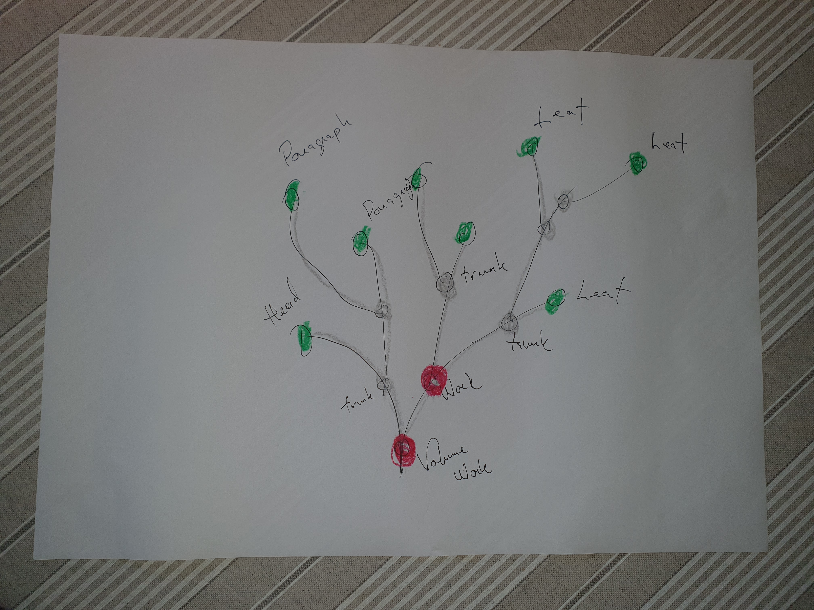

# Solrs and Snippets 

All the software are variations upon a single theme. The theme can be
described as follows:

Assume that we have (semi)structured (meta)data in a database or
repository of some kind.  Then the snippet server is used for
performing various operations upon those data.


Examples of such operations are

* returning documents prepared for indexing
* pieces of texts for reading
* image URIs for viewing pages
* pieces of metadata for a detailed presentation 


We refer to the store as being the _Snippet Server_, the data inside
it as _data_ and the results returned from the operations as
_Snippets_. The word snippet comes from the fact that it is usually
just a part of a document returned.

Currently 

* all the data is in XML format
* the snippet server functionalities are written in XSLT or Xquery or both
* the snippets are returned in JSON, HTML or XML

The Snippet Server has to support CRUD basic functionalities. The
indexing is is currently SOLR and the snippet crud eXist

## Granularity, Identifiers and Indexers

The data used are stored on github. For example, the Archive for Danish Literature corpus is on

https://github.com/kb-dk/public-adl-text-sources

Many of the corpora used are in private repositories. 

All of them are
in [Text Encoding Initiative, TEI for short, markup](http://www.tei-c.org/release/doc/tei-p5-doc/en/html/index.html).
This means that they are basically [ordered hierarchies of overlapping
content objects](http://cds.library.brown.edu/resources/stg/monographs/ohco.html)



### On volumes, works, trunks and leafs

An object in the content hierarchy is a _work_ if annotated with
metadata.  Work units are the ones returned by search engine returns
in the result set.  The granularity is an editorial issue. The higher
density of metadata annotations the more _work_ nodes there are in a
_volume_ and the less text there is in each _work_, the higher the
granularity.

The _leaf_ is the smallest unit of the tree which can be identified
and therefore retrievable and possible to index. The user interface
gives, for each _work_ in a result set a list of _leaf_ nodes that are
relevant for the search. _leaf_ nodes are possible to quote but they
do usually not appear in table of contents.

The _trunk_ nodes are contained in _work_ nodes. They may contain
other _trunk_, _work_ or _leaf_ nodes. It is possible to address a
_trunk_ so it is possible to send a URI to someone and say: <q>Read
chapter 5, it is so good!</q> The _trunk_ is indexed and searchable in
principle. However, the user interface only support them in table of
contents and quotation services.

A _volume_ is what comes close to a physical book. It contains one or
more _work_ nodes. If a _volume_ contains only one and only one work,
we refer to it as a _monograph_.

All text is indexed down to _leaf_ nodes, basically <q>paragraph</q>,
level, which implies

* Paragraph in prose: <kbd>&lt;p&gt; ... &lt;/p&gt;</kbd>
* Speech in drama: <kbd>&lt;sp&gt; ... &lt;/sp&gt;</kbd>
* Strophe in poetry: <kbd>&lt;lg&gt; ... &lt;/lg&gt;</kbd>

Hence if a _work_ is five hundred pages we can find pargraphs, speech
or strophes relevant to a users search, and provide a means to address
them.

### Identifying a node

We have to have a method to identify text segments and reference and
quote them. Both we and our users need that. Here is how we achieve
that:

Documents are indexed in a SOLR search engine. The Indexer, our
software for loading the search eninge,  traverses each TEI document tree creating SOLR documents as
it goes.

Before we do that, though, we make sure that every node is
identifiable using an ID. I.e., we ensure that each element has an
<kbd>xml:id</kbd>. The Indexer must check whether a node has metadata
annotations, i.e., if it is a _work_, in which case it has to pick up
those. Those data are stored in the TEI header. The convention is that
each _work_ [carries a reference to its metadata](https://github.com/kb-dk/public-adl-text-sources/blob/master/work-metadata.md).

Hence, we have a three dimensional space

* document ID
* node ID
* metadata ID

Any thing that should be possible to find for user in the frontend
must have a SOLR document; everything that should be possible to
reference must have an ID. However, for most practical tasks you only
need to take into account the first two.

The document with the following URI as source

https://github.com/kb-dk/public-adl-text-sources/blob/master/texts/munp1.xml

will have its user interface on

https://tekster.kb.dk/text/adl-texts-munp1-shoot-workid57881

(1) adl represents the collection, (2) texts-munp1 is short for the
file-path, that is directory and and file name. I.e., the file is <kbd>adl/texts/munp1.xml</kbd> (3) Finally
shoot-workid57881 identifies (contains the node ID) the part of the
document containing Gustaf Munch-Petersen's poem _søvnen_ which
annotated as being a _work_.

Since file-paths can be long and hyphens are permitted in an xml:id I
separate file-path from node ID with _-shoot-_; the volume node ends
with _-root_.

The same poem can be referred to as a point of a collection of poem,
”det nøgne menneske”

https://tekster.kb.dk/text/adl-texts-munp1-shoot-workid57312#workid57881

in which case we loose the connection with the metadata annotation to
the work _søvnen_

## How to install the Snippet Server and its Data

The installation is more or less automatic. It is using the eXist
servers REST API, so all data are sent to the server using PUT
requests.

The installation is taking place by copying the data into a build
directory in the source tree.

```
ant -p
```

show you the targets. The current ones are shown in the tables below.

### Build and data preparation targets

| Ant command | Description | Depends |
|:------------|:------------|:--------|
| ant clean   | Delete ./build ||
| ant service | Creates ./build/system and ./build/text-retriever. Copies text-service index definition to system all scripts and transforms common for adl, gv and sks into the file system (basically the content of exporters/common) | clean |
| ant base_service | Adds functions specific for  adl, letters, tfs, gv, and sks | service |
| ant other_services | For installing pmm and lhv | service |
| ant add_letters | Adds scripts for Danmarks Breve | | 
| ant add_letter_data | Adds data for Danmarks Breve | | 
| ant add_grundtvig | Copies all gv data into the build area. A complicated task, since it creates an entirely new directory structure and forks external script | base_service |
| ant add_base_data | Copies  adl, tfs and sks  | base_service |
| ant add_other_data | Copies data for pmm and holberg |  other_services |
| ant&nbsp;upload&nbsp;-Dhostport=just.an.example.org:8080 | Installs the text-service backend on http://just.an.example.org:8080. Requires password for the user "admin" on that server | |

The upload function is implemented as a [perl script](#ingest-and-indexing-utilities) executed by ant. Requires perl
library libwww-perl, available as standard package for Linux or from CPAN.

### Example

To install a snippet server on a server with hostname and port number just.an.example.org:8080 use the
following to build and install in the database:

```
 ant service
 ant base_service
 ant add_base_data
 ant upload -Dhostport=just.an.example.org:8080

```

Your new snippet server will contain adl, tfs and sks. To set the permissions of all scripts in one go, "retrieve" the
following URI

```
 http://admin@just.an.example.org:8080/exist/rest/db/text-retriever/xchmod.xq

```

which obviously requires password for "admin" user on just.an.example.org:8080

I sets (at least on some eXist installations) the execute
permissions on all *.xq files. It doesn't work always, and as of
writing this, it is not yet known when and where it works. Then you
have to do that manually according to the eXist manual. See your server

```
http://just.an.example.org:8080/exist/apps/dashboard/index.html

```

## The Snippet Server and its arguments

The scripts and transforms are in the directory exports. For ADL the following are
available

* open-seadragon-config.xq (web service providing JSON for OSD)
* present.xq (general purpose presentation script)
* present-text.xq (a detagger, it extracts raw text from the file)

For letters we have in addition

* save.xq (updates the TEI header in the letter project. Data recieved in JSON). Returns a SOLR document in XML
* volume.xq (renders a table of content for a volume

<!-- xstorage-test-01.kb.dk:8080/text-retriever/ is our test snippet server -->
<!-- just.an.example.org doesn't exist -->

Most Snippet Server scripts support the following arguments

* doc -- the name of the document to be rendered or transformed
* c   -- if there are more sub-collections inside the data set, c is the name of the dirctory where doc is to be retrieved. Default is 'texts' for ADL, other are 'periods' and 'authors'
* path -- the collection, file-path and node ID in the notation described above.
* op  -- is the operation to be performed upon the document doc. Possible op are
  * 'render' which implies that doc is transformed into HTML. http://xstorage-test-01.kb.dk:8080/exist/rest/db/text-retriever/present.xq?doc=texts/aakjaer01val.xml&op=render&c=adl (synonymously using path instead of doc and collection(c))  http://xstorage-test-01.kb.dk:8080/exist/rest/db/text-retriever/present.xq?path=adl-texts-aakjaer01val-root&op=render)
  * 'solrize' which returns a solr <add> ... </add> which is ready to be sent to SOLR. C.f., http://xstorage-test-01.kb.dk:8080/exist/rest/db/text-retriever/present.xq?doc=texts/aakjaer01val.xml&op=solrize&c=adl (**Note**, we hardly ever use the path notion with the solrize operation) 
  * 'facsimile' which returns a HTML document with images of the pages. Since we introduced OSD, it is only used for PDF generation. http://xstorage-test-01.kb.dk:8080/exist/rest/db/text-retriever/present.xq?doc=texts/aakjaer01val.xml&op=facsimile&c=adl (or synonymously http://xstorage-test-01.kb.dk:8080/exist/rest/db/text-retriever/present.xq?path=adl-texts-aakjaer01val-root&op=facsimile)
  * 'toc' returns a HTML table of contents or synonymously http://xstorage-test-01.kb.dk:8080/exist/rest/db/text-retriever/present.xq?path=adl-texts-aakjaer01val-root&op=toc (http://xstorage-test-01.kb.dk:8080/exist/rest/db/text-retriever/present.xq?doc=texts/aakjaer01val.xml&op=toc&c=adl) 
* id  -- the id of a part inside the doc which is to be treated. http://xstorage-test-01.kb.dk:8080/exist/rest/db/text-retriever/present.xq?path=adl-texts-aakjaer01val-shoot-workid59384&op=render (or http://xstorage-test-01.kb.dk:8080/exist/rest/db/text-retriever/present.xq?doc=texts/aakjaer01val.xml&op=render&id=workid59384&c=adl)
* q -- assuming that 'q' is the query, the present.xq is labelling the hits in the text

Some more examples

* Holberg, vol 3, HTML: http://xstorage-test-01.kb.dk:8080/exist/rest/db/text-retriever/present.xq?doc=texts/holb03val.xml&op=render&c=adl
* Heiberg P.A., _Rigsdalers-Sedlens Hændelser_, Andet Kapitel. Detagged (plain text): http://xstorage-test-01.kb.dk:8080/exist/rest/db/text-retriever/present-text.xq?doc=texts/heibergpa01val.xml&id=idm140167182652400&c=adl

* Den politiske Kandstøber, Actus II http://xstorage-test-01.kb.dk:8080/exist/rest/db/text-retriever/present.xq?doc=texts/holb03val.xml&op=render&id=idm140583366846000&c=adl
* A single 'speak' in that play, 
  * as HTML http://xstorage-test-01.kb.dk:8080/exist/rest/db/text-retriever/present.xq?doc=texts/holb03val.xml&op=render&id=idm140583366681648&c=adl
* A TOC for a small work http://xstorage-test-01.kb.dk:8080/exist/rest/db/text-retriever/present.xq?doc=texts/aakjaer01val.xml&op=toc&id=workid59384&c=adl


## Ingest and Indexing utilities

These utilities require the presence a local file system with stuff to be loaded.

### Storing to exist


```
./indexing/exist_loader.pl <options>
where options are
   --load <directory> 
        from where to read files for loading
   --get <directory>
        where to write retrieved files
   --delete <directory with a backup>
        the files in that are found in the directory will be deleted from the
        database if there exist files with the same name

    --suffix <suffix> 
        file suffix to look for in directory. for example xml

    --target <target name>
        Basically database name. Default is 

    --context <context>
        Root for the rest services. Default is /exist/rest/db/

    --user <user name>
    --password <password of user>
    --host-port <host and port for server>
        Default is localhost:8080

For example

exist_loader.pl --file-list files_to_be_indexed.text \
		--user admin \
		--password secret \
		--host-port localhost:8080  \
		--context /exist/rest/db/adl/

will load the xml-files named in files_to_be_indexed.text into a database with base URI

http://localhost:8080/exist/rest/db/adl/
 
```

### Running solrizr and loading solr docs into cloud

```
indexing/solr_updater.pl \
    --file-list=files_to_be_indexed.text \
    --param exist_host=localhost \
    --param exist_port=8080 \
    --param service=adl \
    --param op=solrize \
    --param solr_host=localhost \
    --param solr_port=8983 \
    --param collection=adl

```

This software is dependent on the module URI::Template

```
sudo cpan -e install URI::Template

```

## Minor utilities

* xslt transform all files with `--suffix xml` in the `--directory ./periods/` with a style `--sheet` preprocess.xsl 
```
indexing/transform-all.pl --sheet exporters/common/preprocess.xsl --directory ./periods/ --suffix xml
```

* Validate bagit create or validate bagit manifests
  * create-bag.rb  
  * validate-bag.rb
