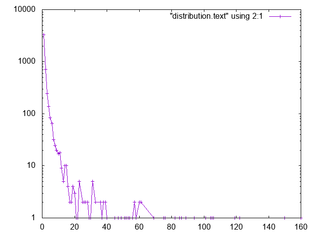

# Sex, death and sonnets

If there are any sonnets, do they rhyme and what are they about?

I have since many years been a great fan of Kenneth Ward Church's
tutorial ["Unix for
Poets"](https://web.stanford.edu/class/cs124/kwc-unix-for-poets.pdf). This
is an investigation of what can be done with a corpus of
literary text with very simple tools similar to the ones described by
Church in his tutorial.

I do not claim that there is anything novel or even significant in this
text. I am not even sure I really know what a sonnet is.
 
## Finding poems

The ADL text corpus contains [literary
texts](https://github.com/kb-dk/public-adl-text-sources). It is easy
to find poetry in those files. Typically a piece of poetry is encoded
as [lines within line
groups](https://tei-c.org/release/doc/tei-p5-doc/en/html/ref-lg.html). More
often than not it is embedded in a &lt;div> ... &lt;/div> element.

It may look like this in the source

```
  <div xml:id="workid68251" decls="#biblid68251">
        <head xml:id="idm140093058532672">Jeg elsker —</head>
        <lg xml:id="idm140093058532240">
          <l xml:id="idm140093058531984">Jeg elsker Himlens høje Harmoni,</l>
          <l xml:id="idm140093058531520">dens Purpurblomst, som blaaner i det Fjærne,</l>
          <l xml:id="idm140093058531024">den Fred, som risler ned fra Nattens Stjerne,</l>
          <l xml:id="idm140093058530576">det Glimt af Gud, der glider mig forbi;</l>
        </lg>
        <lg xml:id="idm140093058530016">
          <l xml:id="idm140093058529760">og Evighedens tavse Melodi,</l>
          <l xml:id="idm140093058529328">de svundne Slægters kaldende Orkester,</l>
          <l xml:id="idm140093058528848">et Tonehav om en usynlig Mester,</l>
          <l xml:id="idm140093058528416">en Klang af Gud, der bruser mig forbi;</l>
        </lg>
        <lg xml:id="idm140093058527856">
          <l xml:id="idm140093058527600">en magisk Magt fra Hjertets mørke Celle,</l>
          <l xml:id="idm140093058527120">de stærke Længsler, som mod Lyset vælde,</l>
          <l xml:id="idm140093058526640">Naturens evigunge Fantasi;</l>
        </lg>
        <lg xml:id="idm140093058526080">
          <l xml:id="idm140093058525824">det Liv, der spirer midt i selve Døden,</l>
          <l xml:id="idm140093058525344">den Sol, der stiger midt i Aftenrøden,</l>
          <l xml:id="idm140093058524864">— o Glimt af Gud, der glider mig forbi!</l>
        </lg>
        <p xml:id="idm140093058524288">
          <date xml:id="idm140093058524032">12. Septbr. 1893.</date>
        </p>
      </div>
```

Michaëlis, Sophus: ”Jeg elsker —”, i Michaëlis, Sophus:
Solblomster. Titelvignet af Frode Eskesen, Gyldendal, 1893,
s. 151. Onlineudgave fra Arkiv for Dansk Litteratur:
https://tekster.kb.dk/text/adl-texts-michs_03-shoot-workid68251

The default name space is declared as
xmlns="http://www.tei-c.org/ns/1.0", which we in following refer to
with the namespace prefix 't'.

The poem comprises four line groups with four, four, three and three
lines. That is a very common strophe structure for
[sonnets](https://en.wikipedia.org/wiki/Sonnet), at least in
Scandinavia. It is not always like that, but they all contain 14
lines.

Shakespeare wrote often his 14 lines typographically in one strophe,
whereas Francesco Petrarca wrote them in two strophes with eight and
six lines, respectively.

To be more precise, a sonnet has one more characteristics than having 14 lines,
the lines should be in [iambic pentameter](https://en.wikipedia.org/wiki/Iambic_pentameter).

## Finding sonnets

You can easily find all poems based on a XPATH query like:

```
//t:div[t:lg and @decls]

```

We can use that query in XSLT like this:

```
  <xsl:for-each select="//t:div[t:lg and @decls]">
        <xsl:if test="count(.//t:lg/t:l)=14">

```

So we iterate over all &lt;div>...&lt;/div>s having line groups inside
and have a @decls attribute containing a reference to metadata in the
TEI header. The latter is not universal, but we use it in ADL. I have
implemented this using a [shell script](find_sonnet_candidates.sh) and
[a transform](sonnet_candidate.xsl). Finally, we don't do anything
unless there are 14 lines of poetry.

This creates a long table with data on the sonnet candidates it finds.

## Approximately pentametric

Finding &lt;div>...&lt;/div>s having 14 lines of poetry isn't good
enough. We are expecting iambic pentameter, don't we? To actually analyse
the texts for their rythmical properties is beyond me, but we could
make an approximation.

Iambic verse consists of feet with two syllables, i.e. if there are
five feet per line we could say that iambic verse has approximately 10
vowels per line. It is an approximation since a iamb should have the
stress on the second syllable (due to ignorance I ignore the musical
aspect of this).

```
  <xsl:variable name="vowel_numbers" as="xs:integer *">
     <xsl:for-each select=".//t:lg/t:l">
        <xsl:variable name="vowels">
           <xsl:value-of select="replace(.,'[^iyeæøauoå]','')"/>
        </xsl:variable>
        <xsl:value-of select="string-length($vowels)"/>
     </xsl:for-each>
  </xsl:variable>
  <xsl:value-of select="format-number(sum($vowel_numbers) div 14, '#.####')"/>
```
We use the replace function and a regular expression to remove
everything in each line except the vowels. Then we measure the string
length which should equal the number of vowels per line and add them
together for all lines in the poem. Finally we divide that sum with 14
and get the average number of vowels per line.

For a sonnet it would be 10, [or occasionally a little
more](https://en.wikipedia.org/wiki/Hendecasyllable). In the Michaëlis poem
quoted above it is 10.4.

## Strophe structure

You can write a lot of nice poetry with 14 lines. Like Gustaf
Munch-Petersen's [en borgers
livshymne](https://tekster.kb.dk/text/adl-texts-munp1-shoot-workid62017)
with one strophe with one line, then three strophes with four lines
and finally a single line. The number of syllables per line seem to
decrease towards the end. Gustaf was a modernist. There are no fixed
structures and very few rhymes i his poetry.

You can easily find out the strophe structure for each poem:

```
 <xsl:variable name="lines_per_strophe" as="xs:integer *">
    <xsl:for-each select=".//t:lg[t:l]">
       <xsl:value-of select="count(t:l)"/>
    </xsl:for-each>
    </xsl:variable>
 <xsl:value-of select="$lines_per_strophe"/>
```

That is, iterate over the line groups in a poem, and count the lines
in each of them.

I have summarized these data about all poems in ADL with 14
lines. There are 243 of them (there are more, but they have erroneous
markup).

You find these sonnet candidates in an html table here
[sonnet_candidates.xml](sonnet_candidates.xml). Find an extract below.

|File name | Title | xml:id | metadata reference | Strophe structure | average number of vowels per line|
|---|---|---|---|---|---|
|./aarestrup07val.xml| [Jeg havde faaet Brev fra dig, Nanette ...](https://tekster.kb.dk/text/adl-texts-aarestrup07val-shoot-workid73888)|workid73888|#biblid73888|4 4 3 3|11.0|
|./aarestrup07val.xml| [Tag dette Kys, og tusind til, du Søde ...](https://tekster.kb.dk/text/adl-texts-aarestrup07val-shoot-workid75376) |workid75376|#biblid75376|4 4 3 3|11.0714|
|./aarestrup07val.xml| [Sonet](https://tekster.kb.dk/text/adl-texts-aarestrup07val-shoot-workid76444) |workid76444|#biblid76444|4 4 3 3|11.5|
|./brorson03grval.xml|[1.](https://tekster.kb.dk/text/adl-texts-brorson03grval-shoot-workid76607) |workid76607|#biblid76607|14|8.7143|
|./claussen07val.xml|[SKUMRING](https://tekster.kb.dk/text/adl-texts-claussen07val-shoot-workid63580)|workid63580|#biblid63580|14|10.8571|
|./claussen07val.xml| [TAAGE OG REGNDAGE](https://tekster.kb.dk/text/adl-texts-claussen07val-shoot-workid66036) |workid66036|#biblid66036|4 4 3 3|13.9286|
|./claussen07val.xml| [MAANENS TUNGSIND](https://tekster.kb.dk/text/adl-texts-claussen07val-shoot-workid66131) |workid66131|#biblid66131|4 4 3 3|13.8571|
|./jacobjp08val.xml| [I Seraillets Have](https://tekster.kb.dk/text/adl-texts-jacobjp08val-shoot-workid63094) |workid63094|#biblid63094|14|6.7143|

Sophus Claussen's first poem may or may not be a sonnet, Brorson's poem are not. All of those
with strophe structure 4 4 3 3 are definitely sonnets, as implied by
strophe structure and the "approximately pentametric" number of vowels
per line (and, by the way, Aarestrup often points out that he is actually
writing sonnets in text or titles).

## Then we have the rhymes

Beauty is in the eye of the beholder, says Shakespeare. I believe that
he is right. Then, however, I would like to add that the rhymes and
meters of poetry (like the pentameter) is in the ear of listener. It
is time consuming to read houndreds of poems aloud and figure out the
rhyme structure. So an approximate idea of the rhymes could be have
comparing the verse line endings.

This is error prone, though. [Consider this sonnet by
P.M. Møller](https://tekster.kb.dk/text/adl-texts-moeller01val-shoot-workid62307).

```
 SONET
 
 Den Svend, som Tabet af sin elskte frister,
 Vildfremmed vanker om blandt Jordens Hytter;
 Med Haab han efter Kirkeklokken lytter,
 Som lover ham igen, hvad her han mister.
 
 Men næppe han med en usalig bytter,
 Hvis Hjerte, stedse koldt for Elskov, brister,
 Som sig uelsket gennem Livet lister,
 Hans Armod kun mod Tabet ham beskytter.
 
 Til Livets Gaade rent han savner Nøglen,
 Hver Livets Blomst i Hjærtets Vinter fryser,
 Han gaar omkring med underlige Fagter.
 
 Ræd, Spøgelser han ser, naar Solen lyser,
 Modløs og syg, foragtet han foragter
 Det skønne Liv som tom og ussel Gøglen.
```

The the last syllable of the eight first lines are the same '-ter'. If
you use some script to compare the endings you'll only find single
syllable rhymes and miss double syllable ones rhymes. I.e., you can
erroneously categorize feminine rhymes (with two syllables) as
masculine ones (with one syllable). (Sorry, I don't know the
politically correct vocabulary for these concepts.)

In order to understand what we hear when reading, we have to consider
'-ister' and '-ytter'. I.e., it starts with rhyme structure 'abbabaab'
not 'aaaaaaaa'. Furthermore, it continues 'cdedec'.

I have written a set of scripts that traverse the
[sonnet_candidates.xml](sonnet_candidates.xml) table. Transform that
file using [iterate_the_rhyming.xsl](iterate_the_rhyming.xsl) selects
poems with 14 lines and strophe structure 4 4 3 3. It generates a
shell script which when executed pipes the content through other
scripts that retrieve content, remove punctuation and finally detags
them. The actual text is then piped through a perl script that
analyse the endings according to the silly and flawed method described
above.

It works, sort of until it doesn't. For poems with 4 4 3 3 strophe structure,  you can find the result in
[rhymes_3chars.text](rhymes_3chars.text) and
[rhymes_2chars.text](rhymes_2chars.text) for three and two letter rhymes, respectively. Run 

```
grep -P '^[a-q]{14}' rhymes_3chars.text   | sort | uniq -c | sort -rn
```

to get a list of rhyme structure and their frequencies. This silly
algorithm does give two of the most common rhyme structure for
sonnets, but misses a lot of order in the chaos:

```
abbaabbacdcdcd
```

and

```
abbaabbacdecde
```

So while it may fail more often than it succeeds, the successes give
results that are reasonable.

The rhyme structure abbaabbacdecde is one is the most common ones found.
Also it is one of the socalled Petrarchan rhyme schemes,
[Cf. this](https://poetscollective.org/everysonnet/tag/abbaabbacdecde/).
 
## What are the sonnets about?

Any piece of art are meant to be consumed by human beings. Poems
should ideally be understood when read aloud and listened to.

The cliché says that art and literature is about what it means to be
human. Could we therefore hypothesize that the sonnets address this
from the point of view of dead Danish male poets who wrote sonnets
some 100 &ndash; 200 years ago?

Assume that, at least as a first approximation, the words chosen by
poets mirror those subjects. For instance, if being human implies
lethality we could, on a statistical level hypothesize that words like
"mourning", "grief", "death", "grave", etc appear in the sonnet corpus
more than in a random sample of text. The opposites would also
expected, concepts related to "love", "birth", "compassion" etc belong
to the sphere of being human.

I have detagged the poems with 14 lines and strophe structure 4 4 3 3,
tokenized their texts and calculated the word frequencies. As a matter
of fact, I've done that in two ways: The first being doing the
classical tokenize and then pipe the stuff through

```
sort | uniq -c | sort -n
```

such that I get a list of the 4781 Danish words that are used in these
sonnets.

The second way is the same, but I do it twice, once foreach sonnet and
then for the whole corpus. That means that I get 

* one list of word frequencies and 
* a second list giving not of the number of occurences of each word, but the number of sonnets the word occurs in.

There are 160 sonnets thus selected in the corpus, and the most
frequent word occurs in all of them. These are the fifteen most
commont word a measured by the [number of sonnets they occur
in](poem_frequencies.text). Number of poems in the left column.


```
     75 du
     76 sig
     82 er
     85 jeg
     86 det
     89 for
     94 den
    101 paa
    104 en
    105 af
    106 til
    119 som
    122 med
    150 i
    160 og
```

and this is the list of the same thing, but measured as the grand
total [occurrence of the words in the
corpus](frequencies.text). Number of words in corpus in left column.


```
    109 min
    130 for
    144 du
    148 er
    155 paa
    164 til
    167 det
    169 den
    173 af
    206 en
    217 med
    229 som
    246 jeg
    382 i
    588 og
```

As you can see this corroborates the established observation that the
most frequent words in a corpus hardly ever describes the subject
matter of the texts (these words are conjunctions, pronouns,
prepositions and the like).



The distribution of the number of sonnets the words appear in. There
is just one word appearing in all 160 sonnets. It is 'og' meaning
'and'. Then there are 3304 words occurring in just one sonnet. The
[distribution.text](distribution.text) is generated from
[poem_frequencies.text](poem_frequencies.text) using

```
sed 's/\ [a-z]*$//' poem_frequencies.text | sort | uniq -c | sort -n -k 2 > distribution.text

```
Column 1 is plotted against column 2.

In this corpus it seems that aboutishness start at words occuring in
25% of the sonnets, or less.

As example we have death, dead and lethal etc in a number of
sonnets. In the left column the number of sonnets containing the word.

```
      1 dødehavet
      1 dødeklokker
      1 dødelige
      1 dødeliges
      1 dødningvuggeqvad
      1 dødsberedthed
      1 glemselsdøden
      1 udødeliges
      2 dødes
      5 dødens
      9 død
      9 døden
     11 døde
```

Love is not as popular as death

```
      1 elskoven
      1 elskovsbrev
      1 elskovsbrevet
      2 elskovsild
      6 elskovs
      7 elskov
```

women not as popular as love

```
      1 dobbeltkvinde
      1 kvindens
      1 kvindetække
      4 kvinder
```

Men more than women, and in particular words implying bravery and male virtues


```
      1 baadsmandstrille
      1 dobbeltmand
      1 ejermand
      1 manddom
      1 manddomstrods
      1 manden
      2 mand
      2 manddoms
      5 mandens
```

Graves occur less than death.


```
      1 begravet
      1 graven
      1 gravene
      1 gravhøi
      1 indgraves
      3 grav
      3 grave
      4 gravens
```

# Conclusions

I think I could go on studying this for a while. However, I have to
conclude this here, before the actual conclusions. There are
interesting things to find here, though.

The result from my armchair text processing exercise supports the
notion that life was already in early modern Europe about sex, death
and rock n'roll. Since rock wasn't there just yet, people had to be
content with sonnets for the time being.

